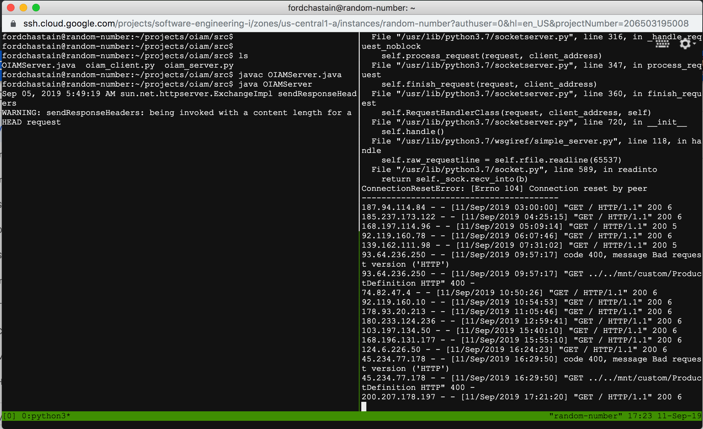
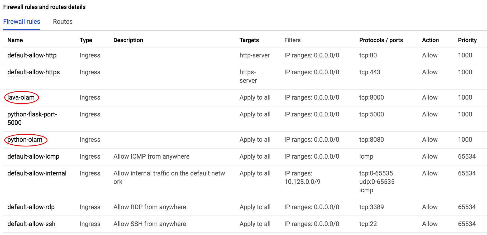
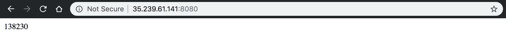
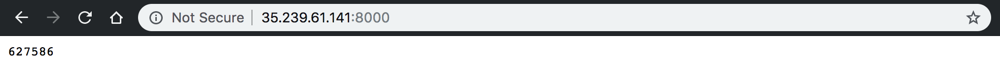
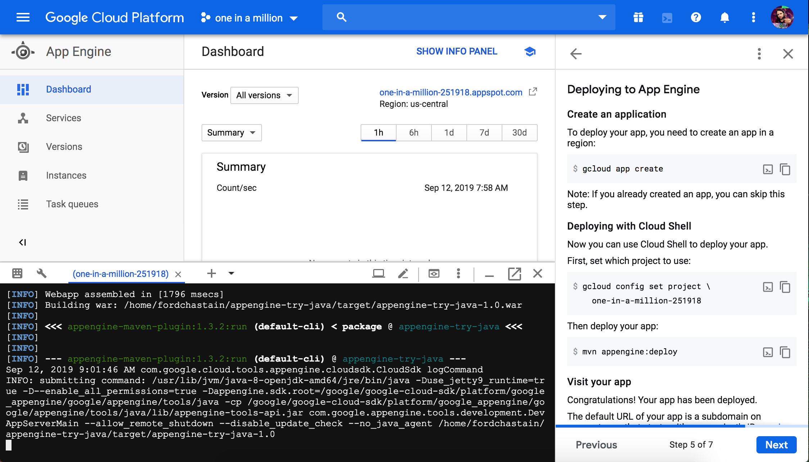
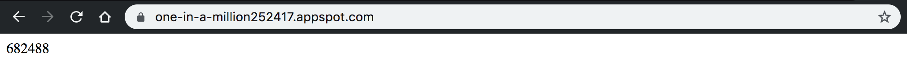
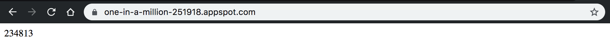
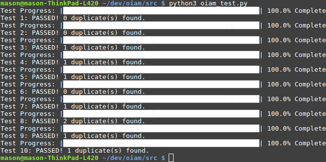
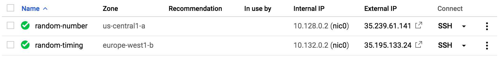

# oiam
## one in a million

`oiam` is a simple server/client application. 

On every request, it generates a random number between 1 and 1,000,000 (inclusive) and serves it.

It is currently implemented as 4 different services, a python and java
implementation running on a virtual machine on Gcloud, as well as a python and java version running on the AppEngine on Gloud.

The python versions are using `flask` on AppEngine and `bottle` on the vm.

The Java version is using `tomcat` on AppEngine and Sun's `HttpServer` on the vm.

All of the programs behave relatively the same, and can be accessed via
the following URLS:

* https://one-in-a-million252417.appspot.com

* https://one-in-a-million-251918.appspot.com

* http://35.239.61.141:8080

* http://35.239.61.141:8000

### Process

For running the virtual machine, we opened a Tmux session and detached from it so that our web servers would be running all of the time. Below you can see the Tmux session running the java web server (left) and python web server (right) simultaneously:

Afterwards, we had to configure our VM's firewall settings so that our web servers were listening on ports 8000 and 8080. 

You can see both running in a web browser below:
#### Python VM

#### Java VM

Google's tutorials were very helpful in setting up our random number servers on the GCP App Engine. After creating a new project for both the Java and Python versions, we cloned the following Git repositories in our cloud shell for the 'Hello, World!' starter code:
* https://github.com/GoogleCloudPlatform/python-docs-samples
* https://github.com/GoogleCloudPlatform/appengine-try-java

After modifying the code to print a random number, we used the `gcloud` commands to create and deploy our apps. Below is a screenshot of our app being deployed from the cloud shell:

Once the apps were deployed, we were provided with the URLs for our projects. You can see both running in a web browser below:
#### Python App Engine

#### Java App Engine

#### Testing
All servers were tested using a python script that took 1000 requests
from the server and looked for duplicates to test for randomness. We
wanted less than 250 duplicates to pass the tests, although often
the sets of 1000 have less than 2 duplicates.

## Timing
As an extension of the requirements, we now host our software on
`europe-west1`, zone 'b', as well as maintaining a module that times the 
requests from a local ip to the new ip's of our software for reporting.

We first moved over our dedicated VMs to the new region.  This was a straightforward port, we just created a new VM in the `europe-west1` region, zone `b`, installed `python3` and `default-JDK`, recompiled our projects and attached them both to HEADLESS `tmux` instances to run on our VM.

Porting our `Java` and `python` `AppEngine` software was similarly straight-forward.  We created a new `AppEngine` instance for both projects, set to the new region, and used our existing code exactly as-is.

![app engine region change] (screenshots/AppEngine.png)

Our timing script is implemented in `python3` using the `requests` library. It reads all the ip's from a seperate file, `urls.txt`, each one separated by a
new line. It times each request using the `timing` library and displays the
destination ip, the random number generated, and the time it took to complete the request.

